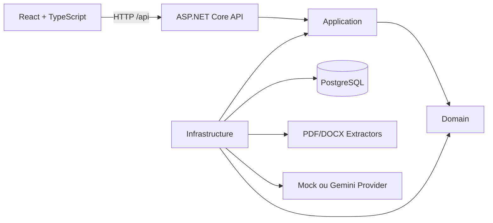
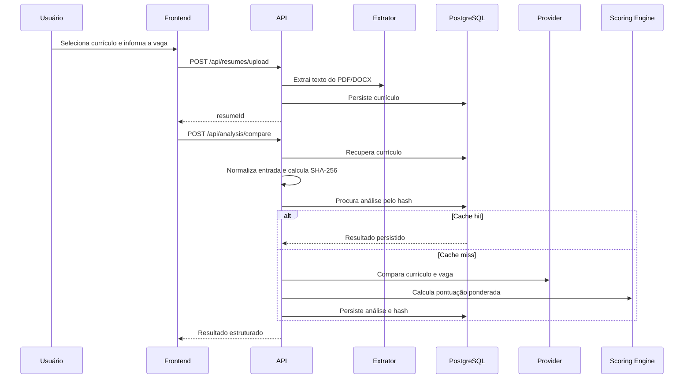

# Arquitetura do ResumeMatcher

## Visão geral

O ResumeMatcher recebe um currículo, extrai seu texto, compara o conteúdo com uma descrição de vaga e devolve uma análise estruturada. O Mock permite execução inteiramente local; o provider Gemini pode ser habilitado por configuração. A deduplicação persistida mantém comparações idênticas consistentes e evita chamadas repetidas ao provider.

## Componentes

### ResumeMatcher.Domain

Contém os dados centrais usados pelo negócio:

- currículo extraído;
- análise persistida;
- resultado da análise;
- itens de evidência.

Essa camada não deve depender de ASP.NET Core, Entity Framework, bibliotecas de documentos ou providers externos.

### ResumeMatcher.Application

Contém os casos de uso e os contratos que isolam detalhes externos:

- upload e validação do currículo;
- coordenação da comparação;
- cálculo ponderado da pontuação;
- contratos de repositório, extração e provider de comparação;
- regras de segurança para futuras otimizações.

### ResumeMatcher.Infrastructure

Implementa os contratos da camada Application:

- `ResumeMatcherDbContext` e repositórios com EF Core/PostgreSQL;
- `PdfResumeTextExtractor` com PdfPig;
- `DocxResumeTextExtractor` com Open XML SDK;
- `MockLLMProvider`, usado para validar o pipeline sem API externa;
- `GeminiLLMProvider`, provider real com Gemini 2.5 Flash via Google.GenAI;
- registro das dependências de infraestrutura.

### ResumeMatcher.Api

É o ponto de entrada HTTP. Responsabilidades:

- registrar dependências e configurações;
- expor controllers REST;
- aplicar CORS e tratamento centralizado de exceções;
- aplicar migrations do EF Core no PostgreSQL durante a inicialização.

### Frontend

Aplicação React criada com Vite. Ela envia o currículo, solicita a comparação e apresenta o score geral, o detalhamento e as evidências retornadas pela API.

## Fluxo principal

## Pontuação

O `WeightedScoringEngine` normaliza cada dimensão entre `0` e `100` e aplica os pesos configurados:

| Dimensão | Peso padrão |
| --- | ---: |
| Skills | 40% |
| Experiência | 30% |
| Senioridade | 15% |
| Requisitos | 10% |
| Formação | 5% |

A soma precisa ser igual a `1`. Uma configuração inválida impede a criação do serviço.

## Persistência

O MVP usa PostgreSQL com Npgsql e migrations do EF Core. Currículos armazenam o texto extraído; análises armazenam scores, o resultado completo serializado em JSON e um `AnalysisInputHash` SHA-256 hexadecimal opcional de 64 caracteres.

O hash é calculado sobre uma representação canônica composta por texto do currículo normalizado, descrição da vaga normalizada, modelo do provider, versão do prompt e versão das regras de análise. A normalização remove espaços e quebras de linha redundantes, mas preserva pontuação e conteúdo semanticamente relevante.

`AnalysisInputHash` possui índice único. Dentro de uma instância da API, requisições simultâneas com o mesmo hash compartilham a análise em andamento. O índice também trata a corrida de persistência entre instâncias; nesse caso, o resultado vencedor é recarregado. Em múltiplas instâncias ainda pode haver duas chamadas externas antes da disputa de inserção, pois o MVP não usa lock distribuído.

A migration inicial cria o esquema PostgreSQL. A coluna do hash é anulável para que registros legados possam continuar válidos, embora análises antigas sem fingerprint não participem do cache. Dados existentes em arquivos SQLite não são transferidos automaticamente.

## Limites de dependência

- `Domain` não referencia nenhum outro projeto.
- `Application` referencia somente `Domain`.
- `Infrastructure` referencia `Application` e `Domain`.
- `Api` referencia `Application` e `Infrastructure`.
- O frontend conversa com o backend somente pela API HTTP.

Não introduza dependências de infraestrutura na camada Domain ou acesso direto ao banco nos controllers.

## Segurança e privacidade

- Extração, scoring e persistência são executados pela aplicação.
- O provider Mock não envia conteúdo para terceiros; o Gemini envia currículo e vaga ao serviço externo quando habilitado.
- Currículos contêm dados pessoais; logs não devem registrar texto integral nem conteúdo de arquivos.
- O uso de IA externa exige consentimento explícito, política de retenção, tratamento de falhas e documentação do provedor.
- Recomendações nunca devem inventar competências, experiências, cargos ou formação.

## Decisões atuais

- **Provider Mock por padrão:** permite validar extração, persistência, UI e pontuação sem custo externo.
- **Gemini opcional:** integração real atrás do mesmo contrato, ativada somente por configuração.
- **Score determinístico:** facilita testes e comparação de resultados.
- **Cache por conteúdo e versão:** garante a mesma resposta persistida para a mesma entrada e invalidação explícita quando modelo, prompt ou regras mudarem.
- **PostgreSQL:** prepara a persistência para evolução de esquema e ambientes compartilhados.
- **Contratos por interface:** permite substituir persistência, extratores e provider sem alterar os casos de uso.
- **API e frontend separados:** mantém as responsabilidades claras e permite implantação independente no futuro.

## Limitações conhecidas

- O vocabulário de skills do Mock é fixo.
- Não há autenticação nem separação de dados por usuário.
- Não há política automática de exclusão de currículos.
- Não há migração automática de dados legados do SQLite para PostgreSQL.
- A otimização automática de currículo ainda não está disponível.
- Não há CI/CD, observabilidade estruturada ou testes de integração HTTP.
