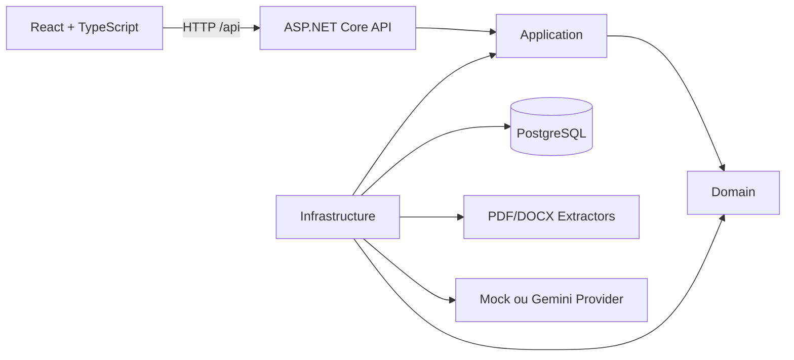
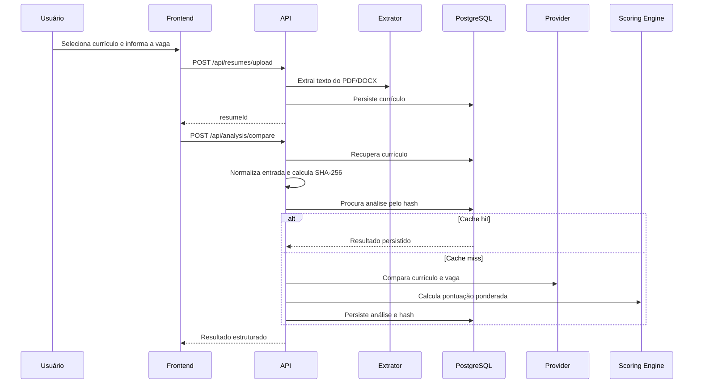

# Arquitetura do Resurva

## Visão geral

O Resurva recebe um currículo, extrai seu texto, compara o conteúdo com uma descrição de vaga e devolve uma análise estruturada. O Mock permite execução inteiramente local; o provider Gemini pode ser habilitado por configuração. A deduplicação persistida mantém comparações idênticas consistentes e evita chamadas repetidas ao provider.

## Componentes

### ResumeMatcher.Domain

Contém os dados centrais usados pelo negócio:

- currículo extraído;
- análise persistida;
- resultado da análise;
- itens de evidência;
- otimização e plano de adaptação (`ResumeOptimizationEntity`).

Essa camada não deve depender de ASP.NET Core, Entity Framework, bibliotecas de documentos ou providers externos.

### ResumeMatcher.Application

Contém os casos de uso e os contratos que isolam detalhes externos:

- upload e validação do currículo;
- coordenação da comparação;
- cálculo ponderado da pontuação;
- contratos de repositório, extração e provider de comparação (`IResumeRepository`, `IAnalysisRepository`, `ILLMProvider`);
- contratos e serviços de otimização responsável (`IResumeOptimizationService`, `IResumeOptimizationProvider`, `IResumeOptimizationRepository`, `IOptimizationSafetyValidator`);
- validação de segurança e regras anti-alucinação no servidor (`Safe`, `NeedsConfirmation`, `Forbidden`).

### ResumeMatcher.Infrastructure

Implementa os contratos da camada Application:

- `ResumeMatcherDbContext` e repositórios com EF Core/PostgreSQL (`ResumeRepository`, `AnalysisRepository`, `ResumeOptimizationRepository`);
- `PdfResumeTextExtractor` com PdfPig;
- `DocxResumeTextExtractor` com Open XML SDK;
- `DocxResumeDocumentExporter` para exportação de currículos adaptados via Open XML SDK;
- `PdfResumeDocumentExporter` para exportação de currículos adaptados via PdfPig com fontes TrueType embutidas;
- `MockLLMProvider` e `MockResumeOptimizationProvider`, usados para validar o pipeline sem API externa;
- `GeminiLLMProvider` e `GeminiResumeOptimizationProvider`, providers reais com modelo configurável via Google.GenAI;
- `GeminiRequestExecutor`, responsável por timeout e retry limitado de falhas temporárias;
- registro das dependências de infraestrutura.

### ResumeMatcher.Api

A integração local de layout usa `ILayoutPreservingExportService` (Application), implementado em Infrastructure. A biblioteca auxiliar `ResumeMatcher.DocumentLayout` contém inspeção/edição/verificação Open XML, sem dependência da API, banco ou domínio. CLI e Infrastructure a referenciam; o backend não referencia executáveis de pesquisa. Endpoints exclusivos de `Development` usam plano canônico e original multipart em memória, sem persistir documentos nem alterar a comparação. [Contrato e limites](LOCAL_LAYOUT_TEST.md).

É o ponto de entrada HTTP. Responsabilidades:

- registrar dependências e configurações;
- expor controllers REST;
- aplicar CORS e tratamento centralizado de exceções;
- autenticar ID tokens Firebase (JWT RS256) e autorizar somente a conta Google verificada configurada;
- aplicar rate limiting e limites de entrada;
- expor `/health` com verificação do banco;
- aplicar migrations do EF Core no PostgreSQL durante a inicialização.

### Frontend

Aplicação React 19 com TypeScript e Vite. Ela substitui a interface monolítica anterior por uma arquitetura modular baseada em feature slices, design tokens em CSS puro (Glass-Precision Neo-Dark), roteamento declarativo com React Router e testes automatizados com Vitest e React Testing Library.

Estrutura de organização:
- `src/shared`: tokens de design (`tokens.css`), tipografia (`Plus Jakarta Sans`, `JetBrains Mono`), reset com scrollbars visíveis acessíveis e componentes atômicos reutilizáveis (`Button`, `Card`, `Badge`, `ScoreRing`, `Spinner`, `Alert`, `EmptyState`).
- `src/app`: shell da aplicação, layout com topbar e badge do usuário (`AppLayout`), provedor de autenticação (`AuthProvider`) e roteamento declarativo (`AppRouter`).
- `src/features/landing`: página institucional (`LandingPage`) com apresentação de valor, prévia ilustrativa identificada, fluxo em 3 passos e rodapé com avisos éticos.
- `src/features/auth`: integração com Firebase Authentication (`LoginPage`, `AuthProtected`), barreira para conta aprovada e validação de sessão contra `/api/auth/session`.
- `src/features/analysis`: dois pilares de entrada (`ResumeDropzone` e `JobDescriptionInput`), estado de processamento com telemetria real e resultado com diagnóstico das 5 dimensões e chips interativos de evidência (`NewAnalysisPage`, `AnalysisResultPage`).
- `src/features/optimization`: validação ética factual (`OptimizationConfirmationsPage`), onde declarações do usuário substituem sugestões apenas com confirmação explícita (edições invalidam a confirmação), e comparação side-by-side com exportação autenticada para PDF e DOCX (`OptimizationAdaptationPage`).

Cada chamada autenticada obtém o ID token atualizado pelo SDK Firebase e o injeta no header `Authorization: Bearer <token>`. A autorização efetiva de acesso pertence exclusivamente à API backend. A suíte de testes unitários do frontend (`pnpm test`) é executada no CI antes da compilação de produção (`pnpm build`).

## Fluxo principal

## Pontuação

O `WeightedScoringEngine` normaliza cada dimensão entre `0` e `100` e aplica os pesos configurados:

| Dimensão | Peso padrão |
| --- | ---: |
| Skills | 40% |
| Experiência | 30% |
| Senioridade | 15% |
| Requisitos | 10% |
| Formação | 5% |

A soma precisa ser igual a `1`. Uma configuração inválida impede a criação do serviço.

## Persistência

O MVP usa PostgreSQL com Npgsql e migrations do EF Core. Currículos armazenam o texto extraído; análises armazenam scores, o resultado completo serializado em JSON e um `AnalysisInputHash` SHA-256 hexadecimal opcional de 64 caracteres.

O hash é calculado sobre uma representação canônica composta por texto do currículo normalizado, descrição da vaga normalizada, modelo e configuração relevante do provider, versão do prompt, versão das regras de análise e configuração de scoring. Atualmente a temperatura do Gemini participa do fingerprint. A normalização remove espaços e quebras de linha redundantes, mas preserva pontuação e conteúdo semanticamente relevante.

O índice único é `(OwnerUserId, AnalysisInputHash)`. Dentro de uma instância, requisições com o mesmo dono/hash compartilham a análise em andamento. Conflitos de persistência entre instâncias recarregam o resultado somente desse dono. Em múltiplas instâncias ainda pode haver chamadas externas duplicadas antes da disputa de inserção; não há lock distribuído.

A migration inicial cria o esquema PostgreSQL. A coluna do hash é anulável para que registros legados possam continuar válidos, embora análises antigas sem fingerprint não participem do cache. Dados existentes em arquivos SQLite não são transferidos automaticamente.

`Analysis.(OwnerUserId, ResumeId)` possui FK para `Resume.(OwnerUserId, Id)`, impedindo associação entre contas diferentes. Excluir um currículo apaga suas análises; repositório e banco garantem a cascata. Todas as operações HTTP usam repositórios com filtro por UID do token, incluindo cache. Acesso administrativo direto ao DbContext não é filtrado; não há RLS configurada por esta aplicação.

Registros têm `UpdatedAt` e expiram após 30 dias desde atualização efetiva. Consultas/cache hit não renovam o prazo. `RetentionCleanupService` é um comando administrativo separado do servidor HTTP; agendamento externo ainda precisa ser ativado. Consulte [Privacidade](DATA_PRIVACY.md) antes de publicar a migration de ownership ou executar limpeza.

## Resiliência e limites

- Chamadas ao Gemini possuem timeout configurável e uma nova tentativa por padrão.
- Apenas timeout e falhas temporárias de rede, rate limit ou indisponibilidade são repetidos.
- Erros do provider são convertidos em respostas HTTP `502`, `503` ou `504` conforme a causa.
- A descrição da vaga aceita no máximo 75.000 caracteres.
- O texto extraído do currículo aceita no máximo 200.000 caracteres.
- Controllers da API compartilham um limite configurável de requisições; `/health` permanece fora desse limite.

## Limites de dependência

- `Domain` não referencia nenhum outro projeto.
- `Application` referencia somente `Domain`.
- `Infrastructure` referencia `Application` e `Domain`.
- `Api` referencia `Application` e `Infrastructure`.
- O frontend conversa com o backend somente pela API HTTP.

Não introduza dependências de infraestrutura na camada Domain ou acesso direto ao banco nos controllers.

## Segurança e privacidade

- Extração, scoring e persistência são executados pela aplicação.
- O provider Mock não envia conteúdo para terceiros; o Gemini envia currículo e vaga ao serviço externo quando habilitado.
- Currículos contêm dados pessoais; logs não devem registrar texto integral nem conteúdo de arquivos.
- `DELETE /api/resumes/{id}` permite apagar o currículo e todas as análises relacionadas.
- O uso de IA externa exige consentimento explícito, política de retenção, tratamento de falhas e documentação do provedor.
- Recomendações nunca devem inventar competências, experiências, cargos ou formação.

## Decisões atuais

A preservação do layout original está em [prova técnica local](RESUME_LAYOUT_PRESERVATION.md), isolada em `tools/layout_probe`. Não modifica os contratos nem a exportação atual da API; armazenamento do original e reflow continuam pendentes.

- **Provider Mock por padrão:** permite validar extração, persistência, UI e pontuação sem custo externo.
- **Gemini opcional:** integração real atrás do mesmo contrato, ativada somente por configuração.
- **Score determinístico:** facilita testes e comparação de resultados.
- **Cache por conteúdo e versão:** garante a mesma resposta persistida para a mesma entrada e invalidação explícita quando modelo, prompt ou regras mudarem.
- **PostgreSQL:** prepara a persistência para evolução de esquema e ambientes compartilhados.
- **Publicação privada inicial:** os dados ficam restritos à conta autorizada pela API; o procedimento para substituir a barreira IAM por autenticação de usuário está em `AUTHENTICATION.md`.
- **Contratos por interface:** permite substituir persistência, extratores e provider sem alterar os casos de uso.
- **API e frontend separados:** mantém as responsabilidades claras e permite implantação independente no futuro.

## Limitações conhecidas

- O vocabulário de skills do Mock é fixo.
- Ownership e cache isolados por UID estão implementados, mas a autorização continua limitada a uma conta. Cadastro multiusuário, encerramento de conta e modo visitante ainda precisam de fluxo próprio.
- Revogação de sessão e desativação de conta no Firebase não são consultadas a cada requisição; um token já emitido pode continuar válido até expirar. A lista de acesso efetiva continua sendo a conta configurada na API.
- Expiração de 30 dias implementada; agendamento da limpeza física e verificação da retenção de backups ainda pendentes.
- A adaptação responsável de currículo gera texto adaptado com revisão e confirmação explícita de itens sem evidência prévia; a exportação para PDF e DOCX está disponível diretamente pelo endpoint `GET /api/optimizations/{id}/export?format=pdf|docx`.
- Testes HTTP usam banco isolado em memória e JWTs sintéticos. Teste separado usa PostgreSQL descartável real para migrations, constraints, cascata e retenção; executado obrigatoriamente pelo workflow CI.
