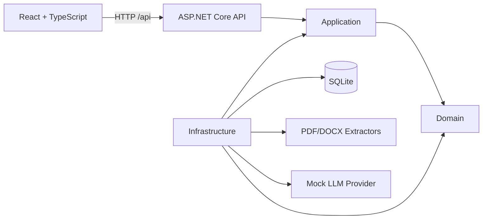
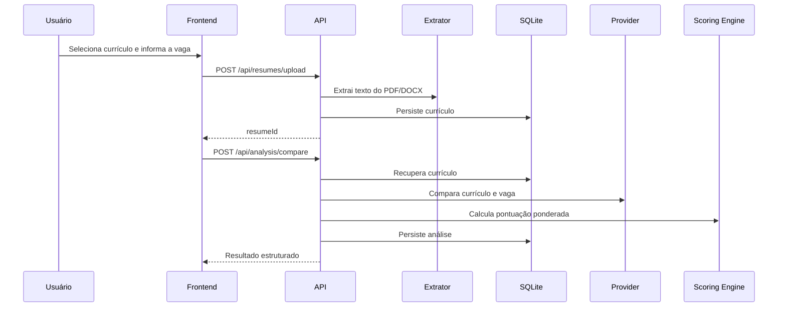

# Arquitetura do ResumeMatcher

## Visão geral

O ResumeMatcher recebe um currículo, extrai seu texto, compara o conteúdo com uma descrição de vaga e devolve uma análise estruturada. O MVP foi desenhado para funcionar localmente e manter a comparação previsível enquanto a integração com um modelo de IA real não está pronta.

## Componentes

### ResumeMatcher.Domain

Contém os dados centrais usados pelo negócio:

- currículo extraído;
- análise persistida;
- resultado da análise;
- itens de evidência.

Essa camada não deve depender de ASP.NET Core, Entity Framework, bibliotecas de documentos ou providers externos.

### ResumeMatcher.Application

Contém os casos de uso e os contratos que isolam detalhes externos:

- upload e validação do currículo;
- coordenação da comparação;
- cálculo ponderado da pontuação;
- contratos de repositório, extração e provider de comparação;
- regras de segurança para futuras otimizações.

### ResumeMatcher.Infrastructure

Implementa os contratos da camada Application:

- `ResumeMatcherDbContext` e repositórios com EF Core/SQLite;
- `PdfResumeTextExtractor` com PdfPig;
- `DocxResumeTextExtractor` com Open XML SDK;
- `MockLLMProvider`, usado para validar o pipeline sem API externa;
- `GeminiLLMProvider`, provider real com Gemini 2.5 Flash via Google.GenAI;
- registro das dependências de infraestrutura.

### ResumeMatcher.Api

É o ponto de entrada HTTP. Responsabilidades:

- registrar dependências e configurações;
- expor controllers REST;
- aplicar CORS e tratamento centralizado de exceções;
- criar o banco SQLite do MVP com `EnsureCreatedAsync`.

### Frontend

Aplicação React criada com Vite. Ela envia o currículo, solicita a comparação e apresenta o score geral, o detalhamento e as evidências retornadas pela API.

## Fluxo principal

## Pontuação

O `WeightedScoringEngine` normaliza cada dimensão entre `0` e `100` e aplica os pesos configurados:

| Dimensão | Peso padrão |
| --- | ---: |
| Skills | 40% |
| Experiência | 30% |
| Senioridade | 15% |
| Requisitos | 10% |
| Formação | 5% |

A soma precisa ser igual a `1`. Uma configuração inválida impede a criação do serviço.

## Persistência

O MVP usa SQLite e cria o esquema automaticamente na inicialização. Currículos armazenam o texto extraído; análises armazenam scores e o resultado completo serializado em JSON.

`EnsureCreatedAsync` é adequado para o protótipo, mas deve ser substituído por migrations do EF Core antes de evoluções de esquema ou uso em produção.

## Limites de dependência

- `Domain` não referencia nenhum outro projeto.
- `Application` referencia somente `Domain`.
- `Infrastructure` referencia `Application` e `Domain`.
- `Api` referencia `Application` e `Infrastructure`.
- O frontend conversa com o backend somente pela API HTTP.

Não introduza dependências de infraestrutura na camada Domain ou acesso direto ao banco nos controllers.

## Segurança e privacidade

- O MVP processa documentos localmente.
- O provider atual não envia conteúdo para terceiros.
- Currículos contêm dados pessoais; logs não devem registrar texto integral nem conteúdo de arquivos.
- Uma integração futura com IA externa precisa de consentimento explícito, política de retenção, tratamento de falhas e documentação do provedor.
- Recomendações nunca devem inventar competências, experiências, cargos ou formação.

## Decisões atuais

- **Provider Mock:** permite validar extração, persistência, UI e pontuação sem custo externo.
- **Score determinístico:** facilita testes e comparação de resultados.
- **SQLite:** reduz dependências no ambiente de desenvolvimento.
- **Contratos por interface:** permite substituir persistência, extratores e provider sem alterar os casos de uso.
- **API e frontend separados:** mantém as responsabilidades claras e permite implantação independente no futuro.

## Limitações conhecidas

- O vocabulário de skills do Mock é fixo.
- Não há autenticação nem separação de dados por usuário.
- Não há migrations ou política automática de exclusão de currículos.
- Não há provider de IA real em funcionamento.
- A otimização automática de currículo ainda não está disponível.
- Não há CI/CD, observabilidade estruturada ou testes de integração HTTP.
